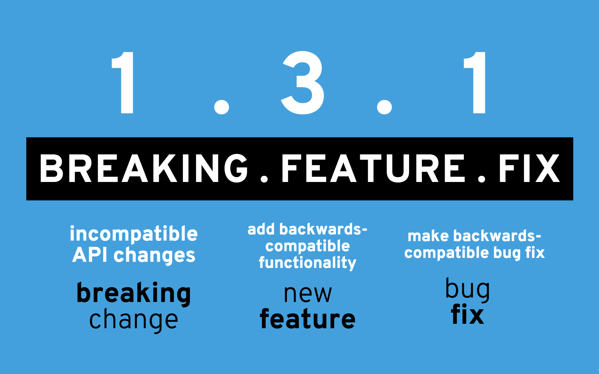

<p align="center">
  <a href="">
    
  </a>
</p>

<h1 align="center">Custom configurable logger framework in Java.</h1>

<div align="center">

[][home]
[][circleci]
[][coverage]
[](https://sonarcloud.io/dashboard?id=com.github.wasiqb.coteafs%3Alogger)
[](https://sonarcloud.io/component_measures?id=com.github.wasiqb.coteafs%3Alogger&metric=Maintainability)
[](https://sonarcloud.io/component_measures?id=com.github.wasiqb.coteafs%3Alogger&metric=Reliability)
[](https://sonarcloud.io/component_measures?id=com.github.wasiqb.coteafs%3Alogger&metric=Security)
[](https://sonarcloud.io/component_measures?id=com.github.wasiqb.coteafs%3Alogger&metric=new_vulnerabilities)
[](https://sonarcloud.io/component_measures?id=com.github.wasiqb.coteafs%3Alogger&metric=Duplications)
[][maven]
[](https://github.com/WasiqB/coteafs-logger/releases)
[](https://opensource.org/licenses/Apache-2.0)

</div>

## :boom: What's this all about?

coteafs-logger is a Java wrapper library build on top of **log4j2**. This library was created to simplify the logging as there is no need to add two dependency of log4j2. Also the logger can be configured using different config formats (Yaml, JSON, XML and properties)

## :golf: What this library offers?

By default if you don't provide the logger config, then it will not log anything. But if the logger file is provided, it will log as per the config setting. To know more about the behavior of config file, check out it's repository [here][configs]

## Loggy Class

This library provides a utility class known as `Loggy` which simplifies the logging. Check the sample code below:

```java
final Loggy log = Loggy.init ();
log.i ("Testing info...");
log.w ("Testing warn...");
log.e ("Testing error...");
log.d ("Testing debug...");
log.t ("Testing trace...");
log.f ("Testing fatal...");
```

Will output the logs as:

```bash
[21:05:58.271] [INFO ] - Testing info... (TestLogging:67)
[21:05:58.273] [WARN ] - Testing warn... (TestLogging:87)
[21:05:58.274] [ERROR] - Testing error... (TestLogging:47)
[21:05:58.274] [DEBUG] - Testing debug... (TestLogging:37)
[21:05:58.275] [FATAL] - Testing fatal... (TestLogging:57)
```

## :soccer: Logger config file

The config file should be placed in `src/test/resources`.
Following is the sample logger config which will create 1 rolling log file and also output the logs on console:

1. `new-log-main.log`

The above generated files will be archived as per the configuration:

- Every next day.
- When log file size exceeds 5 mb.
- On Every Automation Run

**`logger-config.yml`**

```yaml
status: WARN
log_dir: /logs
loggers:
  - name: console-log
    type: CONSOLE
    message_pattern: "[%d{HH:mm:ss.SSS}] [%-5level] - %msg (%logger{1}:%L) %throwable{short.message}%n"
    level: DEBUG
  - name: test-log-appender
    type: FILE
    file_name: new-log-main
    path_pattern: my-log-main-%d{yyyy-MM-dd}.log
    message_pattern: "[%d{HH:mm:ss.SSS}] [%-5level] - %msg (%logger{1}:%L) %throwable{short.message}%n"
    level: INFO
    archive:
      after_days: 1
      after_size: 5
      on_every_run: true
```

## :pushpin: Usage?

You can use the following dependency into your `pom.xml` to use this library.

```xml
<dependency>
  <groupId>com.github.wasiqb.coteafs</groupId>
  <artifactId>logger</artifactId>
  <version>2.0.1</version>
</dependency>
```

## :question: Need Assistance?

* Directly chat with me on my [site][] and I'll revert to you as soon as possible.
* Discuss your queries by writing to me @ wasbhamla2005@gmail.com
* If you find any issue which is bottleneck for you, [search the issue tracker][] to see if it is already raised.
* If not raised, then you can create a [new issue][] with required details as mentioned in the issue template.

## :star: What you do if you like the project?

* Spread the word with your network.
* **Star** the project to make the project popular.
* Stay updated with the project progress by **Watching** it.
* Contribute to fix open issues, documentations or add new features. To know more, see our [contributing][] page.
* I would be delighted if you can **Sponsor** this project and provide your support to open source development by clicking on the **Sponsor button** on the top of this repository.

## :heavy_check_mark: Contributors

<div>
  <ul>
    <li>
      <a href="https://github.com/WasiqB">
        
      </a>
    </li>
    <li>
      <a href="https://github.com/mfaisalkhatri">
        
      </a>
    </li>
  </ul>
</div>

## :ticket: Versioning ideology

<p align="left">
  <a href="http://semver.org/">
    
  </a>
</p>

## :copyright:Wasiq Bhamla

<p align="left">
  <a href="http://www.apache.org/licenses/LICENSE-2.0">
    
  </a>
</p>

[site]: https://wasiqb.github.io
[search the issue tracker]: https://github.com/WasiqB/coteafs-logger/issues?q=something
[new issue]: https://github.com/WasiqB/coteafs-logger/issues/new
[contributing]: .github/CONTRIBUTING.md
[configs]: https://github.com/WasiqB/coteafs-config
[home]: https://github.com/wasiqb/coteafs-logger
[circleci]: https://circleci.com/gh/WasiqB/coteafs-logger
[coverage]: https://sonarcloud.io/component_measures?id=com.github.wasiqb.coteafs%3Alogger&metric=Coverage
[maven]: https://maven-badges.herokuapp.com/maven-central/com.github.wasiqb.coteafs/logger
